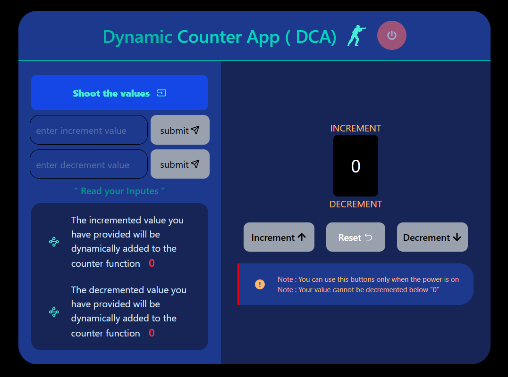
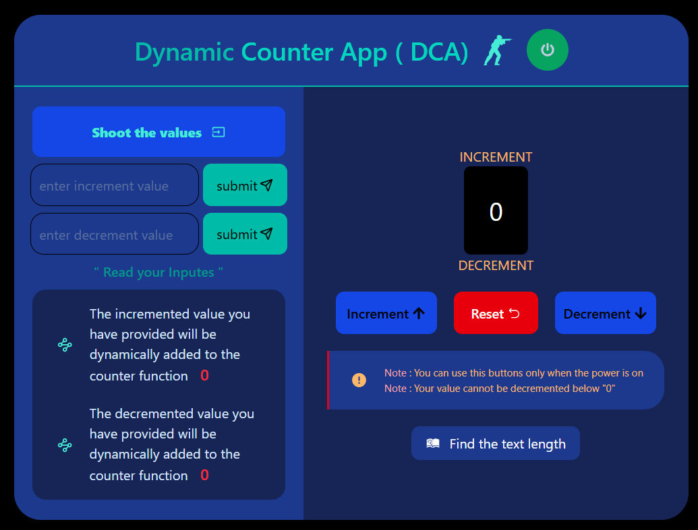
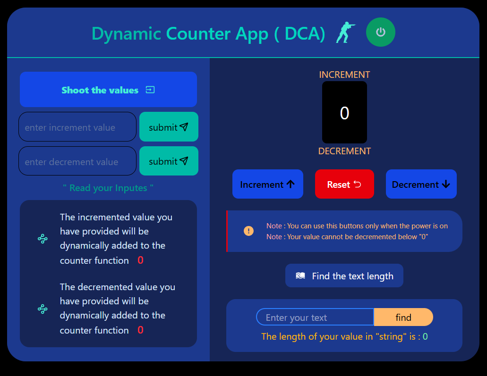
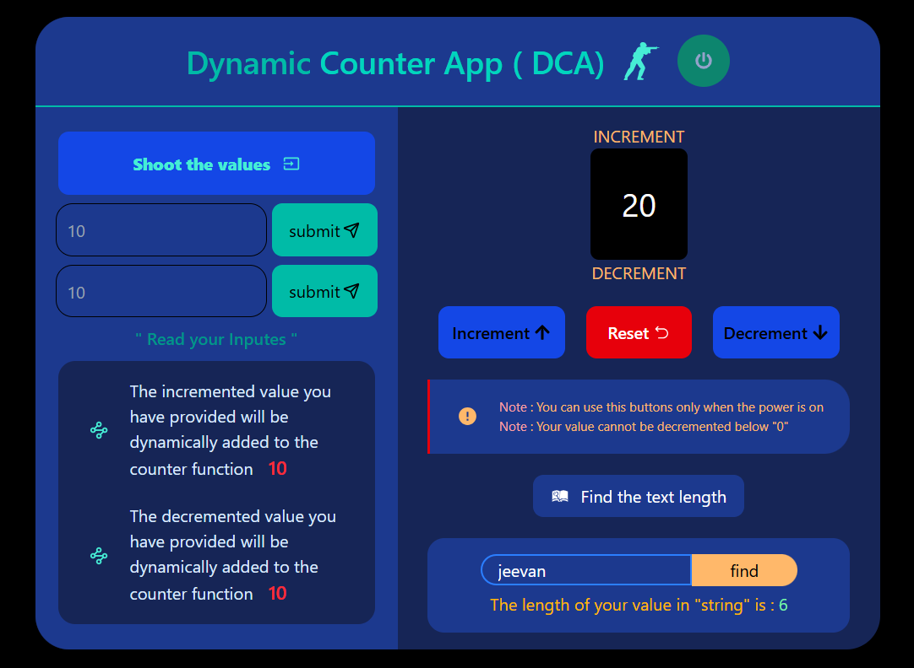

# ⚡ Dynamic Counter App

A modern **React + TypeScript + Vite** project that demonstrates state management, user interactivity, and UI responsiveness.
This app allows users to dynamically **increment, decrement, and reset** a counter with manual input values — all controlled by a **Power System** that enables or disables actions.

---

## 🚀 Overview

The **Dynamic Counter App** provides:

* Custom increment and decrement input fields.
* A counter dashboard displaying real-time values.
* Power control: buttons are only active when power is **ON**.
* Auto power-off after **15 minutes** of inactivity.
* A text-length finder to analyze user-entered text.

---

## 🧠 Features

✅ **Increment & Decrement Controls** — set your own step values.
✅ **Power Toggle System** — disables/enables the counter buttons.
✅ **Auto Power-Off Timer** — turns off after 15 minutes of inactivity.
✅ **Reset Function** — instantly reset the counter to zero.
✅ **Responsive Layout** — designed with Tailwind CSS.
✅ **Text Length Finder** — quickly find the length of your text input.

---

## 🛠️ Tech Stack

| Technology       | Purpose                            |
| ---------------- | ---------------------------------- |
| **React + Vite** | Frontend framework and build tool  |
| **TypeScript**   | Type-safe React components         |
| **Tailwind CSS** | Fast, responsive UI styling        |
| **React Icons**  | Icons for Power / Counter controls |

---

## ⚙️ Installation & Setup

1. **Clone the repository**

   ```bash
   git clone https://github.com/jeevan-sathish/counter-app.git
   ```

2. **Navigate to the project folder**

   ```bash
   cd counter-app
   ```

3. **Install dependencies**

   ```bash
   npm install
   ```

4. **Run the app locally**

   ```bash
   npm run dev
   ```

5. Open in your browser at:
   👉 [http://localhost:5173](http://localhost:5173)

---

## 📸 Screenshots

| Section                          | Preview                                              |
| -------------------------------- | ---------------------------------------------------- |
| 🏠 Counter Dashboard             |    |
| 🔌 Power Control (Enabled)       |        |
| ➕ Increment / ➖ Decrement Inputs |  |
| 🕒 Text Length Finder            |   |

---

## 🧩 Folder Structure

```
counter-app/
├── src/
│   ├── assets/              # Screenshots & images
│   ├── components/          # App components
│   ├── context/             # PowerContext provider
│   ├── App.tsx              # Root app
│   └── main.tsx             # Entry point
├── README.md
├── package.json
├── tsconfig.json
└── vite.config.ts
```

---

## 🧑‍💻 Author

**Jeevan Sathish**
🔗 [GitHub @jeevan-sathish](https://github.com/jeevan-sathish)

---

## 🏁 License

This project is open-source and available under the **MIT License**.
